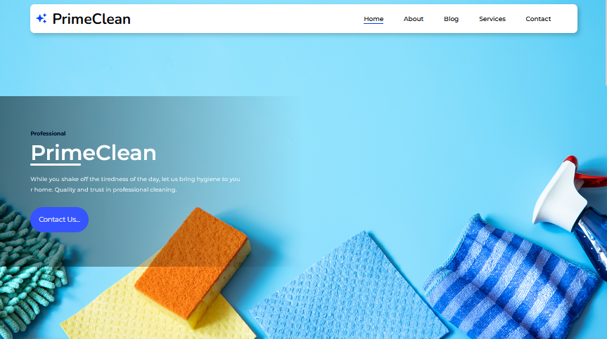

# PrimeClean Web React

A modern, responsive, and user-friendly landing page for a professional cleaning service platform, built with React, TypeScript, and Vite.

---

## 🚀 About This Project

**PrimeClean Web React** is the first website I have ever published on GitHub. I built this project when I was **16 years old** as a personal learning project to improve my front-end development skills.

Rather than simply generating code with AI tools, I focused on understanding how every part of the project works. My goal was to learn the fundamentals of modern web development, including component-based architecture, responsive design, semantic HTML, and clean project organization.

🔗 **Live Demo:** https://delicate-heliotrope-eb7f40.netlify.app/

---

## 🛠️ Tech Stack

- **React.js** – Component-based UI development
- **TypeScript** – Static typing for safer and more maintainable code
- **Vite** – Fast development server and optimized production builds

---

## ✨ Features

- Modern and minimal landing page design
- Fully responsive layout for desktop, tablet, and mobile devices
- Semantic HTML structure
- Clean and organized component architecture
- Fast loading performance
- SEO-friendly markup
- Built with reusable React components

---

## 📐 Development Approach

During development, I focused on writing clean, readable, and maintainable code.

- Semantic HTML elements (`header`, `main`, `section`, `footer`)
- Reusable React components
- Responsive design using modern CSS techniques
- Optimized assets and performance
- Well-structured project organization

The project achieves a **90+ Google PageSpeed Insights Performance Score** after optimization.

---

## 📸 Screenshots

### Homepage



### Phone - HomePage


---

## 💻 Getting Started

Clone the repository:

```bash
git clone https://github.com/your-username/PrimeClean-Web-React.git
```

Move into the project directory:

```bash
cd PrimeClean-Web-React
```

Install the dependencies:

```bash
npm install
```

Start the development server:

```bash
npm run dev
```

---

## 📂 Project Structure

```
src/
├── assets/
    ├── styles/
├── components/
├── App.tsx
└── main.tsx
```

---

## 🎯 Purpose

This project was created to practice and demonstrate:

- Modern React development
- TypeScript fundamentals
- Responsive web design
- Component-based architecture
- Clean code principles
- Front-end project organization

---

## 📄 License

This project is available for educational and portfolio purposes.
